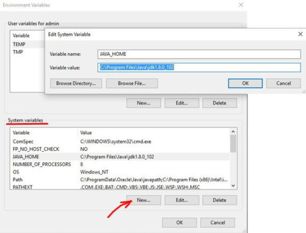
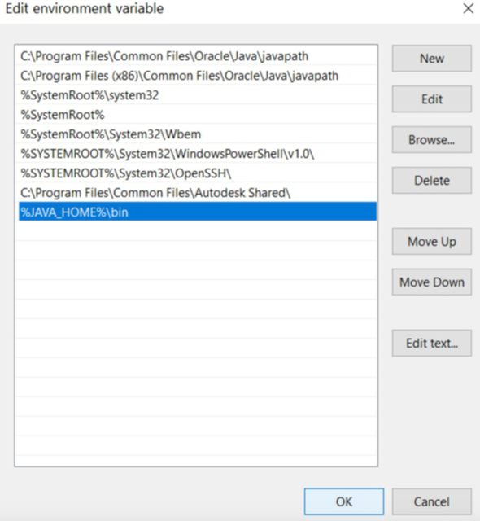
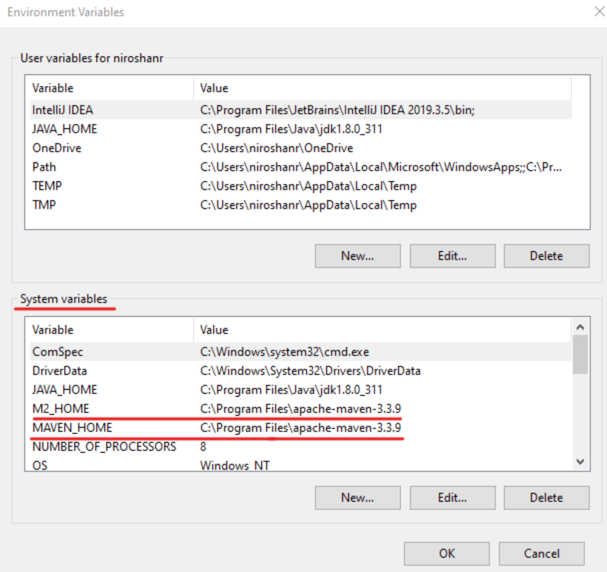
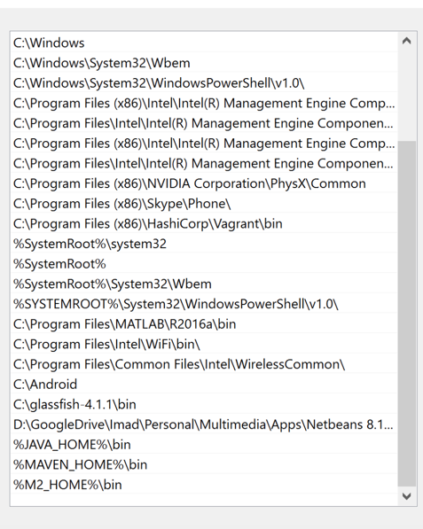

Cilj ovog projekta je da omoguci osnovni uvid u Java UI testiranje sa Selenium i TestNG bibliotekama.  
Ovo je **Maven** projekat i trebalo bi ga "importovati" u razvojno okruznje kao takvog. 
Sajt koji cemo koristit za rad  je: "https://www.saucedemo.com/"  

**Nameštanje sistema**

**Java**  
Pre samog početka potrebno je skinuti Java 11 biblioteku.  
To cemo uradi tako što će mo otici na lokaciju [Java JDK Archiva](https://jdk.java.net/archive/) zatim 
naći 11.0.2(build 11.0.2+9) i kliknuti na Windows 64-bit zip link. Nakon toga otvoriće se prozor 
gde cemo sacuvati ovaj fajl.  
Posto smo sačuvali fajl potreno ga je otpakovati - desnim klikom miša na fajl i izabrati opciju **Extreact All...** zatim u novom prozoru
kliknuti na **Extract** dugme u donjem desnom uglu.  
Nakon toga potrebno je u System varaibles **JAVA_HOME** staviti putanju do otpakovanog foldera, to radimo tako što odemo
u **System Properties > Environment Variables** i u System variables kliknemo na New.. dugme i dodamo novu varijablu JAVA HOME, 
a vrednost varijable je putanja do naseg otpakovanog fajla.  
 
JAVA_HOME:

Zatim u System variables prozor moramo uvrstiti našu JAVA_HOME varijablu u Path varijablu,  
to radimo tako što kliknemo na Path varijablu, zatim kliknemo na dugme New... i dodamo **%JAVA_HOME%\bin** koa novu vrednost.
 
 

PATH:

Da bi smo proverili da li je sve u redu možem otici u Command prompt i ukucati komandu **java -version** i ako nam se prikaže
korektna verzija jave znači da smo sve dobro podesili.
 
 

**Maven**  
Isto što smo uradili sa Javom moramo sada uraditi i sa Maven bibliotekom:  
Otićićemo na sledecu lokaciju [Apache Maven](https://maven.apache.org/download.cgi) i kliknuti na **Binary zip archive** i 
sačuvati fajl na proizvoljnoj lokaciji. 
Takodje moramo otpakovati ovaj skinuti maven folder i zatim isto tako napraviti M2_HOME varijablu u System variables sa lokacijom
ka nasem otpakovanom maven folderu, a zatim u Path varijablu dodati **%M2_HOME%\bin**
 
 
M2_HOME
 
MAVEN_HOME
 

 

%M2_HOME%\bin
 
%MAVEN_HOME%\bin
 

Time smo namestili nase razvojno okruzenje.

